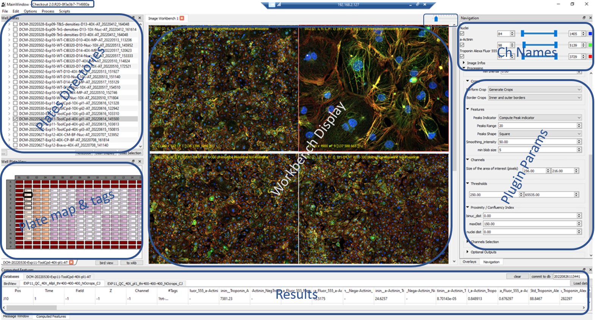
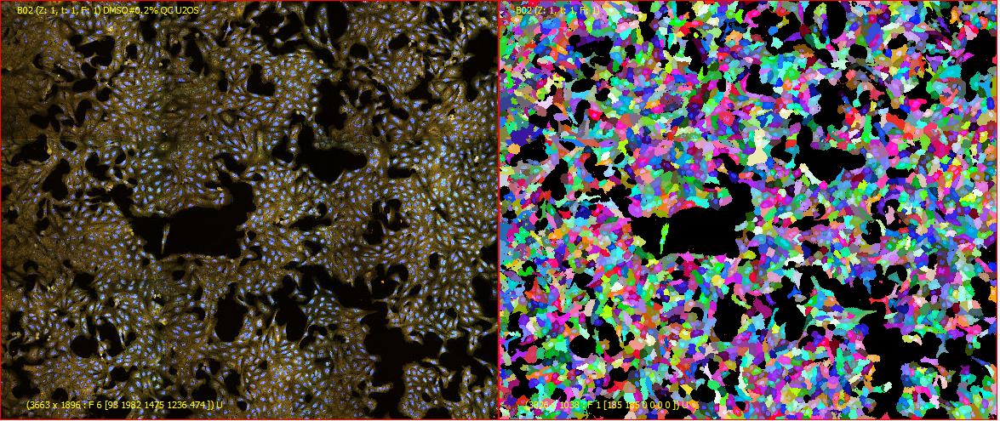

# PhenoLink

## Description
PhenoLink, former "Checkout" is a multipurpose open source high content image analysis software developped at [Ksilink](https://www.ksilink.com/) entirely written in C++ for computational speed purposes.  
Dedicated to biological images produced with automated microscopes, Checkout has a ability to display and analyze all types of images (2D, 3D, 2D+t, 3D+t, Multichannels, etc.) in a speedy and efficient manner due to different level of multi-processing granularities. 

## Features
<!--  -->

* ### Multi Readers
  Mainly developed for Yokogawa (CV7000/CV8000), Checkout also handles InCell and Zeiss readers. More readers can be of course implemented. 
* ### Image Processing

  [OPENCV](https://opencv.org/)  
  [DLIB](http://dlib.net)  
  [Cell Profiler](https://github.com/CellProfiler)

* ### Data Mining
* ### Deep Learning
* ### Visualization
* ### Scability
* ### Data Management

## Getting Started
## Installation
**[VCPKG](https://vcpkg.io/en/getting-started.html) based installation**:  

            git clone https://github.com/Microsoft/vcpkg.git  

            .\vcpkg\bootstrap-vcpkg.bat  

Some libraries are needed to get started usually downloaded automatically during the installation process.
### Dependencies
- OPENCV :  for all image processing 
- DLIB : specific library (Images) 
- MongoDB : Metadata management
- ONNX : Deep Learning inference (Conversion Python model to Onnx)
- ARROW (Apache) : Data efficient and fast storage (feather output file, pandas:pd.read_feather())
- QT : GUI
- WNDCharm : Multiple C++ basic image processing features (similar to cellpainting features)
- Boost : WndCharm needs it.  
#### Optional
- VTK : 3D Visualization
- Python3 : Data Post processing, analysis and vizualisation
- CellProfiler : If cellpainting protocol necessary, checkout handle all the mess for you

### From Sources
* #### Windows
      git clone https://github.com/WiestDaessleImageProcessing/CheckoutApp.git

      mkdir  CheckoutBuild
      cd CheckoutBuild

	
      cmake ..\CheckoutApp -DCMAKE_TOOLCHAIN_FILE=%Path_to_vcpkg%\vcpkg\scripts\buildsystems\vcpkg.cmake  -DVCPKG_TARGET_TRIPLET=x64-windows -G"Ninja Multi-Config"
	or 
	
      cmake ..\CheckoutApp -DCMAKE_TOOLCHAIN_FILE=%Path_to_vcpkg%\vcpkg\scripts\buildsystems\vcpkg.cmake  -DVCPKG_TARGET_TRIPLET=x64-windows -G"Visual Studio 17 2022"

* #### Linux
      git clone https://github.com/WiestDaessleImageProcessing/CheckoutApp.git
      export Qt5_DIR= %Path_to_QT%/Qt/5.15.2/gcc_64/

      cd CheckoutApp && git pull
      

      cd ../Checkout

      cmake ../CheckoutApp/ -DCMAKE_TOOLCHAIN_FILE=/home/checkout/Code/vcpkg/scripts/buildsystems/vcpkg.cmake -DCMAKE_BUILD_TYPE=Release || exit 1

      cmake  --build . -j 72 --config Release --clean-first || exit 1

### Releases  
A signed release for Windows:x64 can be downloaded from here : [Checkout](https://github.com/WiestDaessle/CheckoutBin)
  
  

