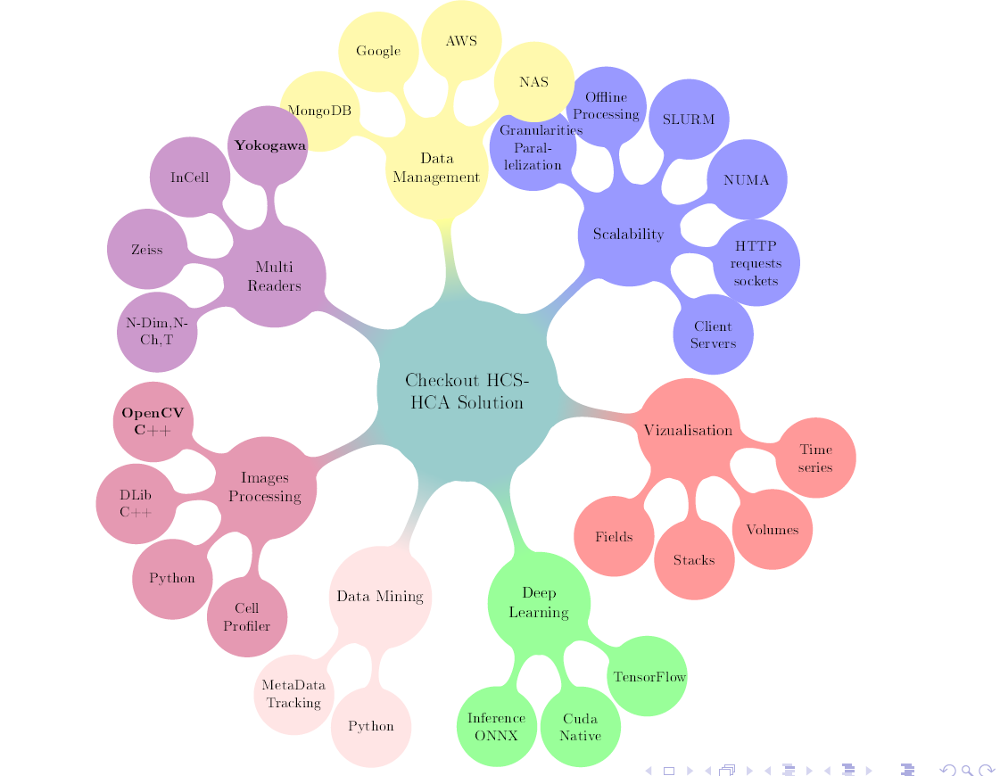
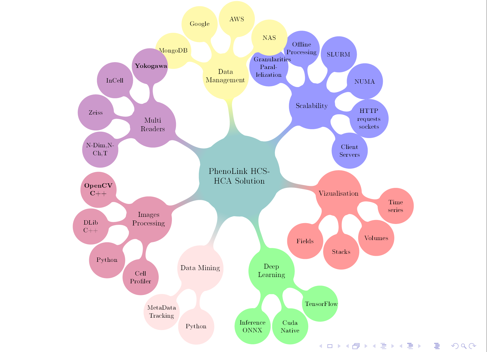

# PhenoLink

## Description
PhenoLink, former "Checkout" is a multipurpose open source high content image analysis software developped at [Ksilink](https://www.ksilink.com/) entirely written in C++ for computational speed purposes.  
Dedicated to biological images produced with automated microscopes, Checkout has a ability to display and analyze all types of images (2D, 3D, 2D+t, 3D+t, Multichannels, etc.) in a speedy and efficient manner due to different level of multi-processing granularities. 

## Features
<!--  -->

* ### Multi Readers
  Mainly developed for Yokogawa (CV7000/CV8000), Checkout also handles InCell and Zeiss readers. More readers can be of course implemented. 
* ### Image Processing

  [OPENCV](https://opencv.org/)  
  [DLIB](http://dlib.net)  
  [Cell Profiler](https://github.com/CellProfiler)

* ### Data Mining
* ### Deep Learning
* ### Visualization
* ### Scability
* ### Data Management

## Getting Started
## Installation

First you need a fully working C++ compiler suite (On windows Visual Studio 2017 up to 2022 where tested and ubuntu 18.04 / 20.04 with gcc)

We use Vcpkg for easier package integration, this builds all the needed dependencies for you

** [cmake](https://cmake.org/) **

**[VCPKG](https://vcpkg.io/en/getting-started.html) based installation**:  

            git clone https://github.com/Microsoft/vcpkg.git  
            # if you have issue with vcpkg updates we tested with commit 0a3bc3d25 
            # git checkout 0a3bc3d25 # successfull vcpkg we are able to build against

On Windows:
            .\vcpkg\bootstrap-vcpkg.bat  

.\bootstrap-vcpkg.bat
.\vcpkg.exe integrate install
.\vcpkg.exe upgrade --no-dry-run # if you want to update existing vcpkg #

Some libraries are needed to get started usually downloaded automatically during the installation process.
### Dependencies
- OPENCV :  for all image processing 
- DLIB : specific library (Images) 
- MongoDB : Metadata management
- ONNX : Deep Learning inference (Conversion Python model to Onnx)
- ARROW (Apache) : Data efficient and fast storage (feather output file, pandas:pd.read_feather())
- Qt : GUI
- WNDCharm : Multiple C++ basic image processing features (similar to cellpainting features)
- Boost : WndCharm needs it.  

#### Optional
- VTK : 3D Visualization
- Python3 : Data Post processing, analysis and vizualisation
- CellProfiler : If cellpainting protocol necessary, PhenoLink handles all the data mapping for you and can launch a Pipeline of CellProfiler within it's plugin framework

### From Sources
* #### Windows
      git clone https://github.com/Ksilink/PhenoLink.git      

      mkdir  PhenoLinkBuild
      cd PhenoLinkBuild

	
      cmake ..\PhenoLink -DCMAKE_TOOLCHAIN_FILE=%Path_to_vcpkg%\vcpkg\scripts\buildsystems\vcpkg.cmake  -DVCPKG_TARGET_TRIPLET=x64-windows -G"Ninja Multi-Config" -DVCPKG_INSTALL_OPTIONS=--x-buildtrees-root=d:/bt -DCMAKE_BUILD_TYPE=Release

	or 
	
      cmake ..\PhenoLink -DCMAKE_TOOLCHAIN_FILE=%Path_to_vcpkg%\vcpkg\scripts\buildsystems\vcpkg.cmake  -DVCPKG_TARGET_TRIPLET=x64-windows -G"Visual Studio 17 2022" -DVCPKG_INSTALL_OPTIONS=--x-buildtrees-root=d:/bt -DCMAKE_BUILD_TYPE=Release

# Then perform the build:
      cmake  --build . -j 12 --config Release

You can pass *--clean-first* to the build command line to be sure to have a clear new build

* #### Linux
      export Qt6_DIR= %Path_to_QT%/Qt/6.X.X/gcc_64/

      git clone https://github.com/Ksilink/PhenoLink.git      

      cd PhenoLink && git pull
      

      cd ../PhenoLink

      cmake ../PhenoLink/ -DCMAKE_TOOLCHAIN_FILE=${HOME}/Code/vcpkg/scripts/buildsystems/vcpkg.cmake -DCMAKE_BUILD_TYPE=Release || exit 1

      cmake  --build . -j 72 --config Release --clean-first || exit 1

### GPU Version

if you want to build with the ONNX library using GPU add to the cmake configuration command line:

      -DONNX_GPU:BOOL=ON 

### Releases  
A  release versuib for Windows:x64 can be downloaded from here : [PhenoLink](https://github.com/Ksilink/PhenoLink/releases)
  
  

